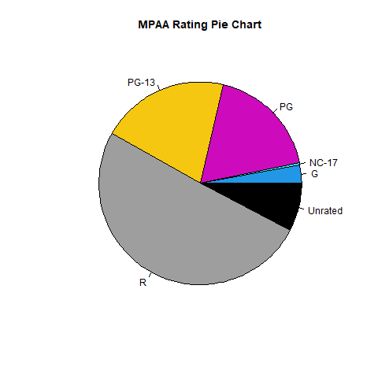
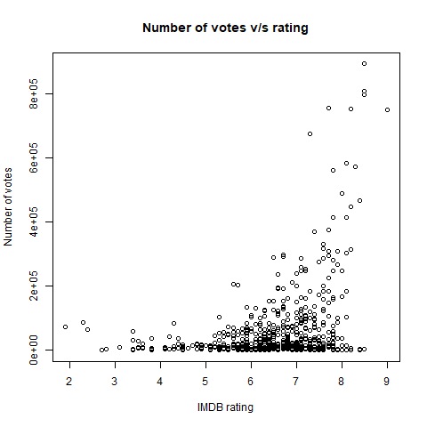

\fontfamily{cmr}
\fontsize{13}{23}
\fontseries{b}
\selectfont

# Q1: 
Histogram of imdb_num_votes

```{r}
moviesData = read.csv(file = "C:/Users/singh/Documents/moviesData.csv", header = TRUE, stringsAsFactors = FALSE, na.strings = "NA")
hist(moviesData$imdb_num_votes, xlab = "Number of votes", ylab = "Number of movies", main = "Number of movies by number of votes on IMDB", col = "lightblue", breaks = 5)
```

\newpage
# Q2: 
Pie chart of mpaa_rating

```{r}
png(file = "mpaa_rating.png")
pie(table(moviesData$mpaa_rating), col = 4:9, main = "MPAA Rating Pie Chart")
dev.off()

```

\newpage
# Q3: 
Bar chart of critics_score for first 10 movies

```{r}
m = matrix(moviesData$critics_score[1:10])
barplot(t(m), xlab = "Movie", ylab = "Critics Score", main = "Critics Score Comparison", col = 5, names.arg = moviesData$title[1:10])
```

\newpage
# Q4: 
Scatterplot of imdb_rating and imdb_num_votes

```{r}
png(file = "votes_vs_rating.png")
plot(moviesData$imdb_rating, moviesData$imdb_num_votes, main = "Number of votes v/s rating", xlab = "IMDB rating", ylab = "Number of votes")
dev.off()

```

\newpage
# Q5: 
Barplot using cyl variable

```{r}
data(mtcars)
d = table(mtcars$vs, mtcars$cyl)
barplot(d, main = "Bar Plot", names.arg = c("4 cyl","6 cyl","8 cyl"), col = c("green", "blue"), xlab = "No of cylinders")
legend("topright", legend = c("V-shaped", "Straight"), fill = c("green", "blue"))
```

\newpage
# Q6: 
Pie diagram

```{r}
com = c("Food", "Rent", "Clothes", "Education", "Savings", "Miscellaneous")
exp = c(300, 200, 125, 110, 90, 75)
pie(exp, main = "Expenditure per commodity", label = com, col = 1:6)
legend("topright", com, fill = 1:6)
```

\newpage
# Q7: 
Subdivided bar diagram

```{r}
data2 = c(21600, 5400, 3600, 1800, 3600)
data3 = c(26000, 7000, 3000, 2000, 2000)
data4 = c(27000, 8100, 3500, 2700, 3600)
df = data.frame(data2, data3, data4)
mylabel = c("Raw materials", "Labour", "Direct expenses", "Office expenses", "Factory expenses")
barplot(as.matrix(df), main = "Cost per scooter (Rs)", xlab = "Year", ylab = "Cost", col = 13:17, names.arg = 2002:2004)
legend("bottomright", legend = mylabel, fill = 13:17)
```

\newpage
# Q8: 
Histogram

```{r}
age = c(18, 20, 25, 30, 40, 50, 60)
freq = c(7, 12, 28, 14, 8, 3, 2)
vec = rep(age, times = freq)
hist(vec, main = "Histogram", xlab = "Age")
```

\newpage
# Q9: 
Heatmap using LifeCycleSavings dataset

```{r}
data(LifeCycleSavings)
View(LifeCycleSavings)
heatmap(as.matrix(LifeCycleSavings), main = "Life Cycle Savings", scale = "column")
```

\newpage
# Q10: 
Heatmap using given dataset

```{r}
var1 = c(0.094, 0.1138, 0.1893, -0.0102, 0.1587, -0.4558, -0.6241, -0.227, 0.7365, 0.9761)
var2 = c(0.668, -0.3847, 0.3303, -0.4259, 0.2948, 0.2244, -0.3119, 0.499, -0.0872, 0.4355)
var3 = c(0.4153, 0.2671, 0.5821, -0.5967, 0.153, 0.6619, 0.3642, 0.3067, -0.069, 0.8663)
var4 = c(0.4613, 0.1529, 0.2632, 0.18, -0.2208, 0.0457, 0.2003, 0.3289, -0.4252, 0.8107)
mat = matrix(c(var1, var2, var3, var4), nrow = 10, ncol = 4)
heatmap(mat, main = "Heatmap", scale = "column", xlab = "Variables", ylab = "Measurements")
heatmap(mat, main = "Heatmap", scale = "column", xlab = "Variables", ylab = "Measurements", Rowv = NA) #without row dendrogram
heatmap(mat, main = "Heatmap", scale = "column", xlab = "Variables", ylab = "Measurements", Colv = NA) #without column dendrogram
```